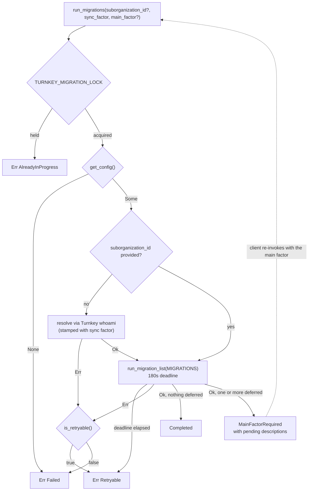
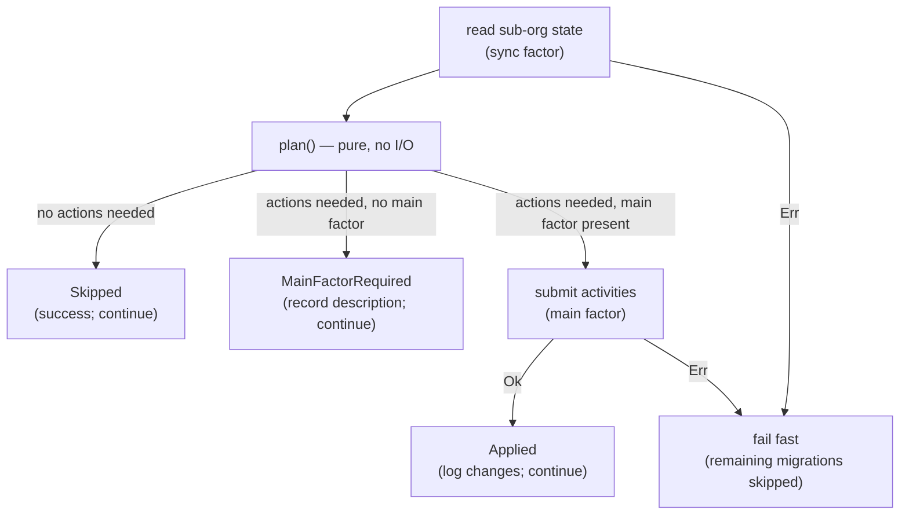

## Turnkey Account Migrations

Migrations reconcile a user's Turnkey account (i.e. sub-organization) against the configuration World App expects (see [Turnkey user setup](https://docs.toolsforhumanity.com/world-app/backup/components#turnkey-user-setup)). They run from `TurnkeyManager::run_migrations`, invoked by the native clients.

> [!NOTE]
> Unrelated to the [General migration engine](../../../migration/README.md), which is a generic migration mechanism usually for wallet state. Turnkey migrations have no state machine and no persistence.

`MIGRATIONS` in `mod.rs` is the single source of truth for which migrations exist and the order they run in.

Reads (`get_users`, `get_policies`) are stamped with the **sync factor**, which every device has. Privileged writes require the **main factor**, an ephemeral session key for `auth_user_main` that only exists after the user re-authenticates.

## Run flow

| Outcome | Meaning for the caller |
| --- | --- |
| `Completed` | Every migration applied or was already satisfied. Nothing to do. |
| `MainFactorRequired` | `pending` describes what is waiting. Prompt for authentication, then re-invoke with the main factor. |
| `Err(Failed)` | Permanent for now. Misconfiguration, consistency error, unauthorized signer. Retrying will not help. |
| `Err(Retryable)` | Transient. Timeout, connectivity, rate limit, or the overall deadline. A later retry may succeed. |
| `Err(AlreadyInProgress)` | A run is already active. Concurrent invocation is a client bug and is logged as a warning. |

`MIGRATION_RUN_TIMEOUT` (180s) bounds the whole run: a degraded Turnkey plus retry backoff must not block the caller forever, and iOS cannot cancel a uniffi async call.

Diagnostic detail never crosses the FFI boundary. It is logged inside Bedrock, prefixed `[Bedrock][TurnkeyMigration]` (from the `log_tag` on the `TurnkeyManager` export, which covers the whole run including the Turnkey API calls) so alerts can key off it. See the log tag table in `AGENTS.md`.

## Per-migration loop

`run_migration_list` walks `MIGRATIONS` in order:

A deferral does **not** stop the run as later migrations that need only the sync factor still apply. An error **does** stop it, so cheap migrations, ones likely to be skipped, and ones not needing the main factor should be ordered first.

Splitting each migration into a pure `plan()` plus a thin apply step is deliberate: `plan()` is unit-testable without a network, which is where nearly all the test coverage sits.

## Target states

### `apple_audience`

Each World App client has its own Apple `aud`, accounts registered when only World App iOS existed have a single audience. Apple issues the same `sub` for every token under one developer account, so the existing `sub` is reused for the providers being added.

Observed state on `auth_user_main`:

| Observed | Plan | Needs main factor |
| --- | --- | --- |
| `auth_user_main` absent | `Err(MainUserNotFound)` → `Failed` | — |
| No Apple provider | `SkipNoAppleProvider`, the user does not use Sign in with Apple | no |
| Apple providers with differing `sub` | `Err(Consistency)` → `Failed`, logged as critical | — |
| All configured audiences present | `SkipReady` | no |
| Some configured audiences missing | `Create` the missing providers, reusing the existing `sub` | yes |

Notes:

- Matching is on `aud`, never on `provider_name`. The name is a convenience label, so a wrong or reused label does not trigger work.
- `create_oauth_providers` is **additive**. It does not upsert or replace.
- Audiences present on the account but absent from the configured table are logged as a warning and left alone. Removing them is a TODO.

### `sync_factor_policy`

Sync factors were once registered with a policy that used version-sensitive `activity.type` clauses and lacked some permissions, notably deleting the sub-organization and users. The canonical policy uses `activity.action` plus `activity.resource`, pinned in `policies.rs`.

Per user in the account:

| Observed | Action |
| --- | --- |
| `auth_user_main` or `break_glass_user` | ignore |
| `user_name` matching no known role | warn (consistency), ignore |
| Sync factor with a malformed `user_id` | log error, ignore, guards against policy-language injection |
| Sync factor, no bound policy | `Create` |
| Sync factor, one bound policy, `EFFECT_ALLOW` and canonical condition | no action |
| Sync factor, one bound policy, effect or condition drifted | `Update` in place, the expected path for legacy accounts |
| Sync factor, two or more bound policies | warn, ignore, cannot tell which is the managed one so never overwrite |

Then, across the whole account:

| Observed | Action |
| --- | --- |
| Any policy bound to a user id no longer in the account | `Delete` |

Notes:

- A policy counts as *bound* only when its consensus is exactly `approvers.any(user, user.id == '<id>')`. Every other shape in the Turnkey policy language (tags, thresholds, several users, negation, extra clauses) is not expected and is never updated nor pruned here.
- Pruning deliberately targets **all** orphaned policies, not just sync factor ones. An orphaned policy has no use.
- The policy name is ignored when deciding whether a policy is up to date; it is only a label.
- `user_id` is validated as a UUID before being interpolated into a consensus expression. A quote in an id could otherwise break out of the string literal.
