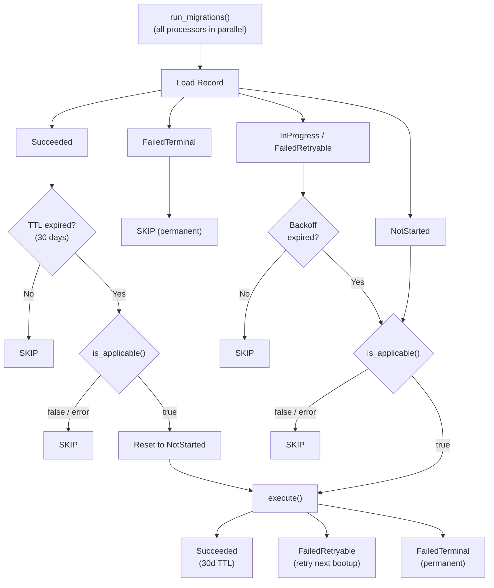

## Migration Controller
The Migration `controller.rs` runs all registered processors **in parallel** using `futures::join_all`. Each processor contains logic around performing an individual migration and conforms to a simple interface:

```rust
trait MigrationProcessor {
    /// Unique identifier for this migration (e.g., "wallet.permit2.approval")
    fn migration_id(&self) -> String;

    /// Determines whether the migration should run based on actual state.
    async fn is_applicable(&self) -> Result<bool, MigrationError>;

    /// Business logic that performs the migration.
    async fn execute(&self) -> Result<ProcessorResult, MigrationError>;
}
```

The migration system is a permanent artifact of the app and is run on app start to bring the app to an expected state. The processors are expected to be idempotent.

## States
The `controller.rs` stores a key value mapping between the id of the migration and a record of the migration. The record most importantly contains the status of the migration, but also useful monitoring and debug information such as `started_at`, `last_attempted_at`.

The possible states are:
- `NotStarted` - migration has not been performed
- `InProgress` - migration started, but was interrupted
- `Succeeded` - migration successfully completed (subject to TTL re-check after 30 days)
- `FailedRetryable` - migration failed, but will be retried on the next app open (e.g. there was a network error). Uses exponential backoff via `next_attempt_at`.
- `FailedTerminal` - migration failed and represents a terminal state. It can not be retried.

For `NotStarted`, `InProgress`, and `FailedRetryable` migrations, `is_applicable()` is called to detect when they become applicable. `FailedRetryable` and `InProgress` respect exponential backoff via `next_attempt_at`. `FailedTerminal` migrations are permanently skipped.

### TTL on Succeeded migrations
`Succeeded` migrations are re-evaluated after 30 days (`MIGRATION_SUCCESS_TTL_DAYS`). When the TTL expires, `is_applicable()` is called again:
- If `true` → the record is reset and the migration re-runs (e.g., USDC allowance decremented below threshold)
- If `false` or error → the migration remains skipped

## State transitions



1. **`NotStarted`**
   - Calls `is_applicable()`. If true, transitions to `InProgress` and runs `execute()`.
   - If false, remains `NotStarted` (checked again on next app start).

2. **`InProgress` / `FailedRetryable`**
   - Checks `next_attempt_at` backoff. If not yet due, skipped.
   - Otherwise calls `is_applicable()` and `execute()`.
   - `execute()` result determines next state: `Succeeded`, `FailedRetryable`, or `FailedTerminal`.

3. **`Succeeded`**
   - Skipped within the 30-day TTL window.
   - After TTL expiry: re-checks `is_applicable()`. If true, resets record and re-executes.

4. **`FailedTerminal`**
   - Permanent. No further transitions.

## Parallel execution
All processors run concurrently within a single `run_migrations()` call. Each processor has its own migration key in the KV store, so there are no data conflicts. A global process-wide lock (`MIGRATION_LOCK`) prevents concurrent `run_migrations()` calls.
