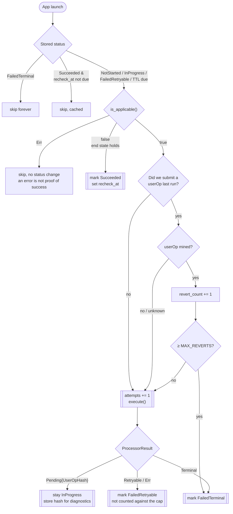

## Migration Controller

The Migration `controller.rs` runs all registered processors **in parallel** using `futures::join_all`. Each processor performs one migration and conforms to a three-method interface:

```rust
trait MigrationProcessor {
    /// Unique identifier for this migration (e.g., "wallet.permit2.approval")
    fn migration_id(&self) -> String;

    /// Is the desired end state still missing? Read real state, not our records.
    async fn is_applicable(&self) -> Result<bool, MigrationError>;

    /// Do the work. Must be idempotent — it is re-run until the end state holds.
    async fn execute(&self) -> Result<ProcessorResult, MigrationError>;
}
```

The migration system is a permanent artifact of the app and runs on app start to bring the app to an expected state.

> [!NOTE]
> Unrelated to the [Turnkey account migrations](../backup/turnkey/migrations/README.md) which are specifically and solely for the Turnkey state.

## The core rule

**On-chain state is the only source of truth.** Stored state is a cache or a diagnostic — it never decides whether a migration worked.

A migration completes when `is_applicable()` returns `false`. There is no receipt lookup, no polling, no waiting on a submitted transaction. If the end state is not yet met, the work is simply done again — which is why **every processor must be idempotent**.

`execute` therefore returns `Pending`, never `Success`. `Success` would mark the migration done on the processor's word alone, before anything confirmed it on-chain; the variant still exists on `ProcessorResult` but is unused.

## Flow


```mermaid
flowchart TD
    Start([App launch]) --> Gate{Stored status}

    Gate -- FailedTerminal --> SkipT[skip forever]
    Gate -- "Succeeded &<br/>recheck_at not due" --> SkipC[skip, cached]
    Gate -- "NotStarted / InProgress /<br/>FailedRetryable / TTL due" --> Applicable{"is_applicable()"}

    Applicable -- Err --> SkipE[skip, no status change<br/>an error is not proof of success]
    Applicable -- "false<br/>end state holds" --> Done[["mark Succeeded<br/>set recheck_at"]]
    Applicable -- true --> WasPending{Did we submit a<br/>userOp last run?}

    WasPending -- no --> Exec
    WasPending -- yes --> Receipt{"userOp mined?"}

    Receipt -- "no / unknown" --> Exec[["attempts += 1<br/>execute()"]]
    Receipt -- yes --> Count[revert_count += 1]
    Count --> Cap{"&ge; MAX_REVERTS?"}
    Cap -- yes --> Terminal[["mark FailedTerminal"]]
    Cap -- no --> Exec

    Exec --> Result{ProcessorResult}
    Result -- "Pending{UserOpHash}" --> InProg[["stay InProgress<br/>store hash for diagnostics"]]
    Result -- Retryable / Err --> Retry[["mark FailedRetryable<br/>not counted against the cap"]]
    Result -- Terminal --> Terminal
```

## Status values

| Status | Meaning | Next launch |
| --- | --- | --- |
| `NotStarted` | never attempted | attempt |
| `InProgress` | **we submitted; outcome unknown** | attempt |
| `Succeeded` | end state confirmed | skip until `recheck_at` |
| `FailedRetryable` | submission failed — nothing reached the chain | attempt |
| `FailedTerminal` | gave up | skip permanently |

`InProgress` vs `FailedRetryable` is the load-bearing distinction: only the former means a transaction actually went out, which is what the failure counter keys off.

## Giving up

Two independent caps, because retrying forever burns sponsored gas.

**`MAX_REVERTS` (controller, userOp migrations).** Incremented only when the previous run was `InProgress` *and* its userOp is confirmed mined *and* the end state is still unmet — i.e. it reverted, or succeeded without the intended effect. A userOp that never mined is **not** counted: that is infrastructure trouble, indistinguishable from being offline, and must not push a working migration to terminal. Likewise `FailedRetryable` is excluded, so no number of offline launches can exhaust the cap.

**`MAX_ATTEMPTS` (in `safe_4337_module_processor.rs`).** That migration relays via `wa_relaySafeTransaction`, which returns an internal transaction id rather than a userOp hash, so the receipt check above can never resolve it. It therefore keeps its own attempt count in the key-value store and returns `Terminal` itself. Every other migration goes the userOp route and is covered by the controller's cap.

## Notes

- **Never-needed migrations are cached.** `NotStarted` + not applicable is recorded as `Succeeded` so `recheck_at` becomes the only trigger; otherwise it would cost an RPC read on every launch forever. It is reported as `skipped`, since nothing executed.
- **Succeeded is re-verified on a TTL.** A migration that regresses (e.g. a USDC allowance spent down) is caught and re-run.
- **`pending_user_op_hash` is written, never read for control flow.** It exists so a retry can be traced back to the submission it supersedes.
