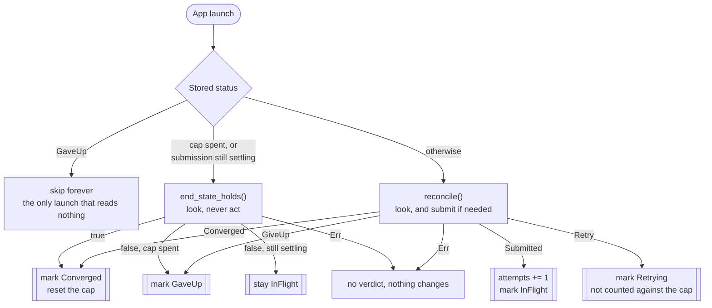

# Migrations

Work that runs on app start to bring the app to an expected state. A permanent
artifact of the app, not a one-off.

Two frameworks under one entry point. `MigrationController::run_migrations`
runs both under a single process-wide lock and merges their summaries.
Everything runs concurrently — the two frameworks race each other, and each
fans out internally with `futures::join_all`.

| | Native migrations | Wallet migrations |
| --- | --- | --- |
| For | anything the app owns — credentials, local state | on-chain wallet operations |
| Trait | `MigrationProcessor` (`#[uniffi::export(with_foreign)]`) | `WalletMigration` (Rust only) |
| Implemented in | Swift / Kotlin, owned by the platform teams | `wallet/` |
| "Done" means | the processor said so | the chain says so |
| Storage key | `migration:{id}` | `migration:wallet:{id}` |
| Record store | shared `RecordStore`, different prefix | same |
| Status enum | `MigrationStatus` (FFI) | `WalletMigrationStatus` |
| Changing it | an FFI break, coordinated across two platforms | a normal PR |

They are separate because they disagree about what completion is, and because
every enum variant the wallet side needs would otherwise be a variant the
platform teams have to ship. Nothing is shared but the lock, the store, and the
`MigrationRunSummary` consumers read.

> [!NOTE]
> Unrelated to the [Turnkey account migrations](../backup/turnkey/migrations/README.md),
> which are solely for Turnkey state.

## Native migrations

Registered by the consumer via `additional_processors`. Three methods —
`migration_id`, `is_applicable`, `execute` — and the controller believes
`ProcessorResult::Success`. Documented by the trait docs in `processor.rs`.

## Wallet migrations

These do on-chain work for the user's smart account: granting an approval,
repairing a Safe's configuration. That is what shapes the whole design.

### Fire-and-forget

A wallet migration submits a transaction and **returns immediately**. It never
waits for a receipt, never polls, never blocks app start on a bundler.

This is not laziness, it is the only honest option. A userOp can be mined,
reverted, or silently dropped by the bundler, and the phone can be closed or
offline for any of it. A migration that waited would stall app start; one that
trusted its own submission would mark work done that never happened. The
earlier design did look up receipts, and tracing every branch showed the
receipt never changed the decision — the `is_applicable` recheck did.

So: **on-chain state is the only source of truth.** The stored record is a
cache and a diagnostic; it never decides whether a migration worked. A
migration is complete when a *later* pass observes the end state — which cannot
be known during the pass that submits the work. `Reconciled` has no success
variant, so that rule is a type rather than a comment.

Because work is re-submitted for as long as the end state does not hold,
**every wallet migration must be idempotent**.

### The two phases

```rust
trait WalletMigration {
    fn migration_id(&self) -> String;

    /// Observe and act, in ONE chain read. The normal path.
    async fn reconcile(&self) -> Result<Reconciled, MigrationError>;

    /// Pure read. Called only when the give-up cap is spent.
    async fn end_state_holds(&self) -> Result<bool, MigrationError>;
}
```

`reconcile` observes once and reuses the value:

```rust
let gap = self.observe().await?;                 // the only read
if gap.is_empty() { return Ok(Reconciled::Converged); }
Ok(Reconciled::submitted(self.send(gap).await?))
```

The gap is a **local**, never a field. That is what made the old
`is_applicable` + `execute` pair unsafe: the first wrote its answer into a
`Mutex` for the second to read, so the two could silently disagree, and
`Safe4337ModuleProcessor` paid for a second chain read because it distrusted the
hand-off.

`end_state_holds` exists for the one case where the controller must know
*without* acting: the give-up cap is spent, and it confirms on chain rather than
spending another submission. A healthy launch never calls it, so no pass ever
reads the chain twice.

### Flow


```mermaid
flowchart TD
    Start([App launch]) --> Gate{Stored status}

    Gate -- GaveUp --> SkipT[skip forever<br/>the only launch that reads nothing]
    Gate -- "cap spent, or<br/>submission still settling" --> Obs["end_state_holds()<br/>look, never act"]
    Gate -- otherwise --> Rec["reconcile()<br/>look, and submit if needed"]

    Obs -- true --> Done[["mark Converged<br/>reset the cap"]]
    Obs -- "false, cap spent" --> Terminal[["mark GaveUp"]]
    Obs -- "false, still settling" --> Wait[["stay InFlight"]]
    Obs -- Err --> SkipE[no verdict, nothing changes]

    Rec -- Converged --> Done
    Rec -- Submitted --> InFlight[["attempts += 1<br/>mark InFlight"]]
    Rec -- Retry --> Retry[["mark Retrying<br/>not counted against the cap"]]
    Rec -- GiveUp --> Terminal
    Rec -- Err --> SkipE
```

**Every launch reads the chain**, except for a migration that has given up. What
gets held back is *submitting*, never looking — so work that landed is noticed
on the very next launch, and a state that drifts back is caught immediately.
There is no success TTL and no cached "already done": the record is never
consulted to decide whether the work is complete.

### Ordering

`Safe4337ModuleMigration` is a prerequisite, not a peer. It relays an
owner-signed `execTransaction`, so it is the only migration that works on a Safe
which cannot yet validate a userOp — every other migration submits one.

It runs first and alone. Dependents run only once it has **converged**, which is
an observation, never a submission: the cold start that relays the repair does
not also run them. Nothing waits on tx-sitter.

### Status values

| Status | Meaning | Next launch |
| --- | --- | --- |
| `NotStarted` | never reconciled | reconcile |
| `InFlight` | submitted; not yet observed on chain | reconcile once the cooldown elapses |
| `Converged` | end state observed | observe again; act if it drifted |
| `Retrying` | the pass failed; nothing was submitted | reconcile |
| `GaveUp` | terminal | skip permanently |

`InFlight` vs `Retrying` is load-bearing: only the former means something
actually went out, which is what the cap and the cooldown key off.

### Giving up, and the cooldown

`MAX_ATTEMPTS` (5) counts submissions **observed to have failed**, per gap. Once
spent, the next pass calls `end_state_holds` alone and never submits: it either
finds the work landed after all (recorded `Converged`) or confirms the gap
(`GaveUp`). An observation error reaches no verdict and retries next launch.
Converging resets the count — it closes the gap, so a state that drifts back
years later starts over.

Only *accepted* submissions count — a pass that fails or cannot reach the
network returns `Retry` — so no number of offline launches can exhaust it, and
no receipt lookup is needed to tell the two apart.

`RESUBMIT_COOLDOWN_HOURS` (1) is what makes that cap meaningful. An in-flight
submission is given an hour to land before another is sent; past that it never
will. Without it, a user restarting the app a few times in a minute would burn
all five attempts before the first submission could mine. It gates only the
submission — the chain is still read on every one of those launches.

## Adding a migration

1. Implement `WalletMigration` in `wallet/`, or `MigrationProcessor` in
   Swift/Kotlin for a native one.
2. Register it — wallet migrations in `WalletMigrationController::new`, native
   ones via `additional_processors`.

### Versioning

Put the version in the ID (`wallet.safe.enable_4337_module.v1`). To change a
migration, add a new one with a new ID rather than editing the old. Both can
coexist: v1 is already converged for existing users, and v2 runs for those who
need it. One ID, one migration, forever.

### Storage

Each migration's record lives under its own key, so there is no ceiling on how
many can exist and no single-key size limit to hit in `SharedPreferences` or
`UserDefaults`. Records are independent — one corrupt entry cannot block the
rest, and is treated as a reset.

### App reinstalls

On uninstall, records and data both go. On reinstall with account recovery, data
comes back from backup but records do not — `DeviceKeyValueStore` is not backed
up.

This costs nothing, because no migration trusts its record. A wallet migration
reads the chain, which is already correct; a native processor's `is_applicable`
must likewise check actual restored state, not history.

### Notes

- **A migration that was never needed reports `skipped`, not `succeeded`.**
  Nothing was done, and otherwise every fresh install would show a burst of
  successes it never earned.
- **Convergence is not final.** A state that regresses (a USDC allowance spent
  down) is observed on the next launch and re-submitted on the spot.
- **`last_submission` is written, never read for control flow.** It exists so a
  retry can be traced back to the submission it supersedes.
