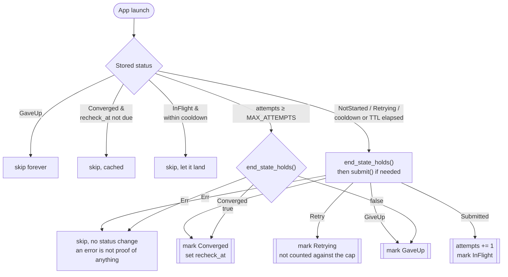

# Migrations

Two frameworks, one entry point. `MigrationController::run_migrations` runs both
under a single process-wide lock and merges their summaries. Everything runs
concurrently — the two frameworks race each other, and each fans out internally
with `futures::join_all`.

| | Native migrations | Wallet migrations |
| --- | --- | --- |
| Trait | `MigrationProcessor` (`#[uniffi::export(with_foreign)]`) | `WalletMigration` (Rust only) |
| Implemented in | Swift / Kotlin, owned by another team | `wallet/` |
| "Done" means | the processor said so | the chain says so |
| Storage key | `migration:{id}` | `migration:wallet:{id}` |
| Status enum | `MigrationStatus` (FFI) | `WalletMigrationStatus` |
| Changing it | an FFI break, coordinated across two platforms | a normal PR |

They are separate because they disagree about what completion is, and because
every enum variant the wallet side needs would otherwise be a variant the
platform teams have to ship. Nothing is shared but the lock, the store, and the
`MigrationRunSummary` consumers read.

> [!NOTE]
> Unrelated to the [Turnkey account migrations](../backup/turnkey/migrations/README.md),
> which are solely for Turnkey state.

## Native migrations

Registered by the consumer via `additional_processors`. Three methods —
`migration_id`, `is_applicable`, `execute` — and the controller believes
`ProcessorResult::Success`. This half is unchanged and is documented by its
trait docs in `processor.rs`.

## Wallet migrations

**On-chain state is the only source of truth.** The stored record is a cache and
a diagnostic; it never decides whether a migration worked.

A migration defines two phases and nothing else:

```rust
trait WalletMigration {
    fn migration_id(&self) -> String;

    /// Observe. A pure read — the only place "is there work to do" is decided.
    async fn end_state_holds(&self) -> Result<bool, MigrationError>;

    /// Submit work to close the gap. Must be idempotent.
    async fn submit(&self) -> Result<Reconciled, MigrationError>;
}
```

The controller wires them together, so no migration can restate or reorder the
check:

```rust
if migration.end_state_holds().await? { return Ok(Reconciled::Converged); }
migration.submit().await
```

Both halves read through one private observe method returning the gap as a
value — never stashed on `self`, which is what made the old `is_applicable` +
`execute` pair unsafe.

`Reconciled` has no success variant. A migration is complete only when a *later*
pass observes the end state — which cannot be known during the pass that submits
the work. Nothing is ever waited on, and no receipt is read anywhere.

The controller also calls `end_state_holds` on its own, once: when the give-up
cap is spent, it confirms on chain rather than spending another submission, so a
migration is never written off on the strength of an unwatched transaction.

### Flow


```mermaid
flowchart TD
    Start([App launch]) --> Gate{Stored status}

    Gate -- GaveUp --> SkipT[skip forever]
    Gate -- "Converged &<br/>recheck_at not due" --> SkipC[skip, cached]
    Gate -- "InFlight &<br/>within cooldown" --> SkipF[skip, let it land]
    Gate -- "NotStarted / Retrying /<br/>cooldown or TTL elapsed" --> Rec["end_state_holds()<br/>then submit() if needed"]

    Rec -- Err --> SkipE[skip, no status change<br/>an error is not proof of anything]
    Rec -- Converged --> Done[["mark Converged<br/>set recheck_at"]]
    Rec -- Retry --> Retry[["mark Retrying<br/>not counted against the cap"]]
    Rec -- GiveUp --> Terminal[["mark GaveUp"]]
    Rec -- Submitted --> InFlight[["attempts += 1<br/>mark InFlight"]]

    Gate -- "attempts &ge; MAX_ATTEMPTS" --> Settle{"end_state_holds()"}
    Settle -- true --> Done
    Settle -- false --> Terminal
    Settle -- Err --> SkipE
```

### Ordering

`Safe4337ModuleMigration` is a prerequisite, not a peer. It relays an
owner-signed `execTransaction`, so it is the only migration that works on a Safe
which cannot yet validate a userOp — every other migration submits one.

It runs first and alone. Dependents run only once it has **converged**, which is
an observation, never a submission: the cold start that relays the repair does
not also run them. Nothing waits on tx-sitter.

### Status values

| Status | Meaning | Next launch |
| --- | --- | --- |
| `NotStarted` | never reconciled | reconcile |
| `InFlight` | submitted; not yet observed on chain | reconcile once the cooldown elapses |
| `Converged` | end state observed | skip until `recheck_at` |
| `Retrying` | the pass failed; nothing was submitted | reconcile |
| `GaveUp` | terminal | skip permanently |

`InFlight` vs `Retrying` is load-bearing: only the former means something
actually went out, which is what the cap and the cooldown key off.

### Giving up, and the cooldown

`MAX_ATTEMPTS` (5) counts submissions **observed to have failed**, per gap. Once
spent, the next pass calls `end_state_holds` alone and never submits: it either
finds the work landed after all (recorded `Converged`) or confirms the gap
(`GaveUp`). An observation error reaches no verdict and retries next launch.
Converging resets the count — it closes the gap, so a state that drifts back
years later starts over.

Only *accepted* submissions count — a pass that fails or cannot reach the
network returns `Retry` — so no number of offline launches can exhaust it, and
no receipt lookup is needed to tell the two apart.

`RESUBMIT_COOLDOWN_HOURS` (1) is what makes that cap meaningful. An in-flight
submission is given an hour to land; past that it never will, so the next launch
re-observes and re-submits. Without it, a user restarting the app a few times in
a minute would burn all five attempts before the first submission could mine.

### Notes

- **Never-needed migrations are cached.** A first pass that converges is recorded
  as `Converged` so `recheck_at` is the only trigger, and reported as `skipped` —
  nothing was done, and otherwise every fresh install would show a burst of
  successes.
- **Convergence is re-verified on a TTL.** A state that regresses (a USDC
  allowance spent down) is caught and re-run. This is a spend knob, not only an
  RPC knob: a recheck that finds drift submits on the spot.
- **`last_submission` is written, never read for control flow.** It exists so a
  retry can be traced back to the submission it supersedes.
