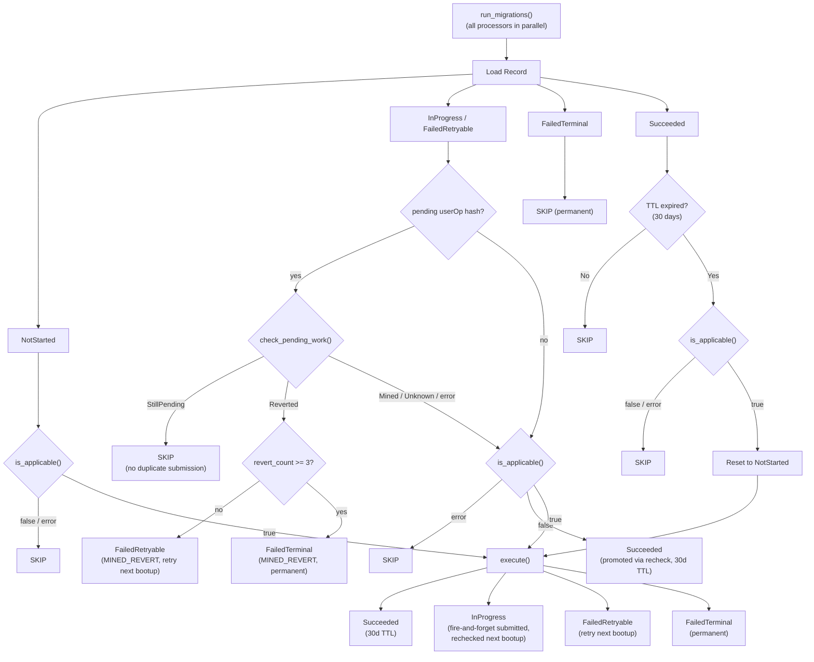

## Migration Controller
The Migration `controller.rs` runs all registered processors **in parallel** using `futures::join_all`. Each processor contains logic around performing an individual migration and conforms to a simple interface:

```rust
trait MigrationProcessor {
    /// Unique identifier for this migration (e.g., "wallet.permit2.approval")
    fn migration_id(&self) -> String;

    /// Determines whether the migration should run based on actual state.
    async fn is_applicable(&self) -> Result<bool, MigrationError>;

    /// Business logic that performs the migration.
    async fn execute(&self) -> Result<ProcessorResult, MigrationError>;
}
```

The migration system is a permanent artifact of the app and is run on app start to bring the app to an expected state. The processors are expected to be idempotent.

> [!NOTE]
> Unrelated to the [Turnkey account migrations](../backup/turnkey/migrations/README.md) which are specifically and solely for the Turnkey state.

## States
The `controller.rs` stores a key value mapping between the id of the migration and a record of the migration. The record most importantly contains the status of the migration, but also useful monitoring and debug information such as `started_at`, `last_attempted_at`.

The possible states are:
- `NotStarted` - migration has not been performed
- `InProgress` - migration started, but has not been confirmed complete yet (interrupted, or fire-and-forget work like an on-chain transaction is still pending)
- `Succeeded` - migration successfully completed (subject to TTL re-check after 30 days)
- `FailedRetryable` - migration failed, but will be retried on the next app open (e.g. there was a network error).
- `FailedTerminal` - migration failed and represents a terminal state. It can not be retried.

For `NotStarted`, `InProgress`, and `FailedRetryable` migrations, `is_applicable()` is called to detect when they become applicable. `FailedRetryable` and `InProgress` are retried on every app open. `FailedTerminal` migrations are permanently skipped.

### Fire-and-forget transactions
Transaction-submitting migrations (e.g. Permit2 approvals) do not wait for their transaction to be mined. `execute()` submits the transaction and returns `ProcessorResult::Pending { user_op_hash }`, which keeps the migration `InProgress` and persists the submission reference on the record.

On the next run, the controller first resolves the outstanding submission via `check_pending_work(user_op_hash)`:
- `StillPending` → the migration is skipped this run (no duplicate submission while the transaction is mining).
- `Reverted` → the migration is marked `FailedRetryable` with error code `MINED_REVERT` (the revert is visible in logs and on the record) and re-executes on the next run. After `MAX_MINED_REVERTS` (3) reverts the migration becomes `FailedTerminal` instead of resubmitting indefinitely; the revert counter resets on success.
- `Mined` / `Unknown` / error → fall through to the `is_applicable()` end-state recheck below.

Then `is_applicable()` re-checks the actual on-chain state:
- If the desired end state now holds (`is_applicable()` returns `false` for an `InProgress` or `FailedRetryable` migration), the controller promotes the migration to `Succeeded`.
- If the transaction reverted or was dropped, `is_applicable()` returns `true` and the migration re-executes.
- If `is_applicable()` errors, the migration is skipped without any state change (an error is not proof of completion).

### TTL on Succeeded migrations
`Succeeded` migrations are re-evaluated after 30 days (`MIGRATION_SUCCESS_TTL_DAYS`). When the TTL expires, `is_applicable()` is called again. If it errors (e.g. RPC outage), the recheck is retried after a short TTL (`MIGRATION_RECHECK_ERROR_RETRY_DAYS`, 1 day) rather than on every app open:
- If `true` → the record is reset and the migration re-runs (e.g., USDC allowance decremented below threshold)
- If `false` or error → the migration remains skipped

## State transitions


```mermaid
flowchart TD
    Start["run_migrations()<br/>(all processors in parallel)"] --> Load["Load Record"]

    Load --> NotStarted
    Load --> InProgressRetryable["InProgress / FailedRetryable"]
    Load --> FailedTerminal
    Load --> Succeeded

    FailedTerminal --> SkipTerminal["SKIP (permanent)"]

    Succeeded --> TTLCheck{"TTL expired?<br/>(30 days)"}
    TTLCheck -- No --> SkipTTL["SKIP"]
    TTLCheck -- Yes --> TTLApplicable{"is_applicable()"}
    TTLApplicable -- "false / error" --> SkipTTLFalse["SKIP"]
    TTLApplicable -- true --> ResetRecord["Reset to NotStarted"] --> Execute

    InProgressRetryable --> HasPending{"pending userOp hash?"}
    HasPending -- yes --> CheckPending{"check_pending_work()"}
    CheckPending -- StillPending --> SkipStillPending["SKIP<br/>(no duplicate submission)"]
    CheckPending -- Reverted --> RevertCount{"revert_count >= 3?"}
    RevertCount -- no --> RevertRetryable["FailedRetryable<br/>(MINED_REVERT, retry next bootup)"]
    RevertCount -- yes --> RevertTerminal["FailedTerminal<br/>(MINED_REVERT, permanent)"]
    CheckPending -- "Mined / Unknown / error" --> ApplicableIP
    HasPending -- no --> ApplicableIP{"is_applicable()"}
    ApplicableIP -- error --> SkipIPErr["SKIP"]
    ApplicableIP -- "false" --> Promote["Succeeded<br/>(promoted via recheck, 30d TTL)"]
    ApplicableIP -- true --> Execute

    NotStarted --> Applicable{"is_applicable()"}
    Applicable -- "false / error" --> SkipNA["SKIP"]
    Applicable -- true --> Execute

    Execute["execute()"] --> Success["Succeeded<br/>(30d TTL)"]
    Execute --> Pending["InProgress<br/>(fire-and-forget submitted,<br/>rechecked next bootup)"]
    Execute --> Retryable["FailedRetryable<br/>(retry next bootup)"]
    Execute --> Terminal["FailedTerminal<br/>(permanent)"]
```

1. **`NotStarted`**
   - Calls `is_applicable()`. If true, transitions to `InProgress` and runs `execute()`.
   - If false, remains `NotStarted` (checked again on next app start).

2. **`InProgress` / `FailedRetryable`**
   - Retried on every app open. For `InProgress` records with a stored pending userOp hash, `check_pending_work()` runs first: `StillPending` → skip (no duplicate submission), `Reverted` → `FailedRetryable` with `MINED_REVERT`, `Mined`/`Unknown`/error → continue below.
   - Calls `is_applicable()`:
     - If `false`, the desired end state already holds (e.g. a fire-and-forget transaction was mined) → promoted to `Succeeded`.
     - If it errors, the migration is skipped with no state change.
     - If `true`, runs `execute()`.
   - `execute()` result determines next state: `Succeeded`, `Pending` (stays `InProgress`, stores the userOp hash), `FailedRetryable`, or `FailedTerminal`.

3. **`Succeeded`**
   - Skipped within the 30-day TTL window.
   - After TTL expiry: re-checks `is_applicable()`. If true, resets record and re-executes.

4. **`FailedTerminal`**
   - Permanent. No further transitions.

## Parallel execution
All processors run concurrently within a single `run_migrations()` call. Each processor has its own migration key in the KV store, so there are no data conflicts. A global process-wide lock (`MIGRATION_LOCK`) prevents concurrent `run_migrations()` calls.
