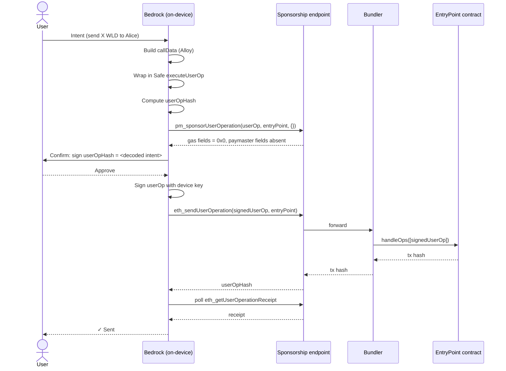
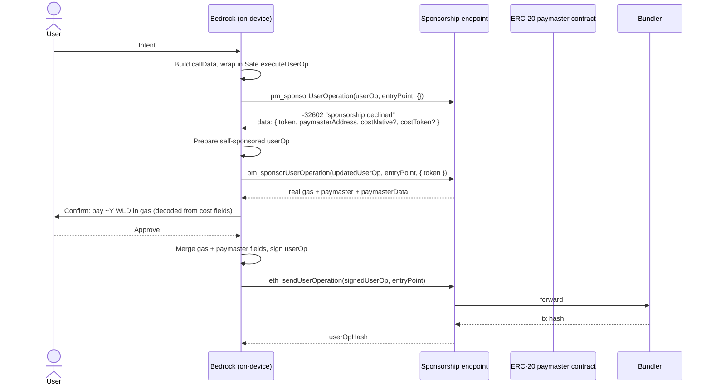

# Prepare & Sign Transaction

This document describes how Bedrock — the open-source, on-device SDK that powers
the wallet — turns a user intent (e.g. "send 5 WLD to `0x…`") into a signed
[ERC-4337 UserOperation](https://eips.ethereum.org/EIPS/eip-4337) that lands on
chain.

It is a living document. The wallet's sponsorship policy evolves over time;
when it changes, this file changes with it. The on-device steps Bedrock performs
do not depend on the server's policy — only on the wire contract described
below.

## Trust model

The wallet is **self-custodial**. The user's signing key never leaves the
device, and the user should sign only payloads they can independently verify.
Bedrock is structured around that invariant:

- **Bedrock constructs the calldata locally.** All encoding — ERC-20
  calls, Safe `executeUserOp` wrapping, and any composition needed for a
  given transaction — happens on device, using
  [Alloy](https://github.com/alloy-rs/core) primitives that the user (or a
  third-party auditor) can inspect by reading the Bedrock source.
- **The remote sponsorship endpoint is a sponsor and a relay.** It chooses
  whether to pay gas, attaches paymaster signatures when the user pays in an
  ERC-20 token, and forwards the signed UserOp to a bundler. It does not
  construct calldata, does not modify the user's calldata, and the on-chain
  outcome can be diffed against what Bedrock built before signing.
- **The user signs the UserOp hash, not a server-provided blob.** The hash is
  derived from the fully-assembled UserOp (sender, nonce, callData, gas
  fields, paymaster fields if any) per
  [ERC-4337 §4.1](https://eips.ethereum.org/EIPS/eip-4337#useroperation).

The boundary is sharp: anything the server returns is treated as untrusted
input. Gas fields and paymaster fields are merged into the UserOp, but the
calldata Bedrock submits is byte-equal to the calldata Bedrock built locally.

## What this design replaces

Earlier wallet flows had a remote service construct the calldata and the
UserOp hash from the user's intent (token, amount, recipient); the device
then signed the resulting hash. This design moves calldata construction
onto the device so the user signs only payloads the device can
independently verify.

## High-level flow

For every transaction:

1. **Build callData.** Encode the contract call (ERC-20 `transfer`, ERC-4626
   `deposit`, etc.) using Alloy.
2. **Wrap in `executeUserOp`.** The user's wallet is a
   [Safe smart account](https://docs.safe.global/) with the ERC-4337 module
   installed. Bedrock wraps the inner call in a
   `executeUserOp(to, value, data, operation)` invocation on the module so
   the UserOp executes through the smart account when the EntryPoint
   dispatches it.
3. **Compute the UserOp hash locally.** Used for confirmation UI and to verify
   later that the chain transaction matches what was signed.
4. **Ask for sponsorship.** Bedrock calls `pm_sponsorUserOperation` with an
   empty context. The endpoint either sponsors directly (the wallet pays gas
   on the user's behalf) or returns a structured decline with the information
   needed to retry as a self-paid transaction.
5. **(Decline branch only.) Retry as self-sponsored.** Bedrock retries the
   request in self-sponsored mode using the token returned in the decline
   payload; the endpoint then returns the gas estimates and paymaster
   fields needed to finalise the UserOp.
6. **Sign.** Bedrock merges the gas (and paymaster, if any) fields into the
   UserOp and signs locally with the device key.
7. **Submit.** `eth_sendUserOperation` ships the signed UserOp through the
   relay; the relay forwards it to a bundler which calls `handleOps` on the
   [EntryPoint](https://eips.ethereum.org/EIPS/eip-4337#entrypoint).
8. **Poll for receipt.** Bedrock polls `eth_getUserOperationReceipt` until
   the UserOp is mined.

From iOS or Android, all of the above is a single FFI call; the two
round-trips inside it (sponsor + send) are not exposed to the platform layer.

## Sponsored path (wallet pays gas)



**Wire shape — sponsored response:**

```json
{
  "callGasLimit": "0x0",
  "verificationGasLimit": "0x0",
  "preVerificationGas": "0x0",
  "maxFeePerGas": "0x0",
  "maxPriorityFeePerGas": "0x0"
}
```

The five gas fields are zeroed and the paymaster fields (`paymaster`,
`paymasterData`, `paymasterVerificationGasLimit`, `paymasterPostOpGasLimit`)
are **absent** from the response, not present-with-zero values. Bedrock
detects absent fields via `Option<…>` in Rust and skips
`with_paymaster_data()`. The bundler estimates gas when the UserOp is
submitted, so explicit gas values are not required from the wallet on this
path.

## Decline → self-sponsored retry (user pays gas in an ERC-20 token)

When the endpoint declines to sponsor, the wallet falls back to the user
paying gas in an ERC-20 token (e.g. WLD) routed through an ERC-20 paymaster
contract. The flow is mechanical:



**Wire shape — decline payload (`-32602`):**

| Field              | Required | Meaning                                                                                          |
| ------------------ | -------- | ------------------------------------------------------------------------------------------------ |
| `token`            | yes      | ERC-20 token address the user should pay gas in (e.g. WLD). Bedrock uses this for the retry.     |
| `paymasterAddress` | yes      | ERC-20 paymaster contract that will pull the fee at execution time.                              |
| `costNative`       | no       | Advisory: estimated gas cost in native units (hex wei). May be absent.                           |
| `costToken`        | no       | Advisory: estimated cost in the token's smallest unit (hex). Surface to the user when available. |

The two required fields are sufficient to build the retry; the advisory cost
fields are best-effort and Bedrock must tolerate their absence. The wallet
should never proceed with the retry if `token` or `paymasterAddress` is
missing — it should surface an error to the user instead.

**Wire shape — self-sponsored response:**

```json
{
  "callGasLimit": "0x…",
  "verificationGasLimit": "0x…",
  "preVerificationGas": "0x…",
  "maxFeePerGas": "0x…",
  "maxPriorityFeePerGas": "0x…",
  "paymaster": "0x…",
  "paymasterData": "0x…",
  "paymasterVerificationGasLimit": "0x…",
  "paymasterPostOpGasLimit": "0x…"
}
```

All gas fields populated, all paymaster fields present. Bedrock merges them
into the UserOp and calls `with_paymaster_data()` before signing.

## Per-step details

### 1. Build callData

Done locally with Alloy. For an ERC-20 transfer this is
`transfer(to, amount)`. For ERC-4626 deposits, Permit2 transfers, vault
migrations, etc., the relevant function is encoded against the on-chain ABI.

Nothing leaves the device at this step.

### 2. Wrap in `executeUserOp`

The actual call is wrapped in `executeUserOp(to, value, data, operation)` on
the Safe's ERC-4337 module. This becomes the `callData` field of the UserOp;
when the EntryPoint dispatches the UserOp, it calls `executeUserOp` on the
smart account, which performs the inner call.

### 3. Compute the UserOp hash

ERC-4337's UserOp hash is deterministic given the fully-assembled UserOp,
the EntryPoint address, and the chain ID. Bedrock computes it locally so the
user can be shown exactly what they are about to sign.

### 4. First sponsorship call

`pm_sponsorUserOperation` is called with the partial UserOp (sender, nonce,
callData, signature placeholder, optional factory/factoryData) and an empty
context. The endpoint inspects current conditions and either:

- returns a sponsored response (zeroed gas, absent paymaster fields), or
- returns `-32602 "sponsorship declined"` with the structured payload above.

### 5. Self-sponsored retry

When the endpoint declines to sponsor, Bedrock retries the request in
self-sponsored mode using the token returned in the decline payload. The
second response carries the gas estimates and paymaster fields needed to
finalise the UserOp.

### 6. Sign

The UserOp is finalised by merging the gas (and, on the retry path, the
paymaster) fields. Bedrock recomputes the UserOp hash to ensure it still
corresponds to the intent shown to the user, then signs with the device key.

### 7. Submit

`eth_sendUserOperation(signedUserOp, entryPoint)`. The endpoint forwards to
a bundler. Bedrock receives the userOpHash back and stores it for receipt
polling.

### 8. Poll for receipt

`eth_getUserOperationReceipt` is polled until the UserOp is mined or until a
deadline is reached. The user-facing state machine (`pending`, `mined`,
`failed`) is derived from the receipt.

## Error handling

All responses use HTTP `200 OK`; success vs. error is indicated by the
JSON-RPC body. Bedrock categorises outcomes as follows:

| Category                | How it manifests                           | Bedrock's response                                                                                                             |
| ----------------------- | ------------------------------------------ | ------------------------------------------------------------------------------------------------------------------------------ |
| Network / transport     | HTTP error, timeout                        | Surface to user as transient; the user may retry. No signing occurred.                                                         |
| Sponsorship declined    | `-32602` with `token` + `paymasterAddress` | Run the self-sponsored retry (steps 5–7).                                                                                      |
| Invalid request         | `-32602` without the decline payload       | Bug in Bedrock — should not happen in production. Surface generically; do not retry.                                           |
| Endpoint internal error | `-32603`                                   | Surface as transient; user may retry. No signing occurred.                                                                     |
| Bundler error on send   | error on `eth_sendUserOperation`           | Surface to user; the UserOp was signed but not accepted by the bundler. Bedrock does not auto-retry sends to avoid duplicates. |
| Mined-revert            | receipt with `success: false`              | Surface as a failed transaction. The on-chain effect is whatever the EntryPoint did before reverting (typically nothing).      |

In every category Bedrock retains the locally-built calldata and the
locally-computed userOpHash, so the user-facing failure message can be
specific without trusting the endpoint to describe what went wrong.

## Versioning and compatibility

The sponsorship endpoint is **path-versioned**. JSON-RPC method calls are
issued to `/<version>/rpc/<network>`, where `<version>` is selected by
Bedrock per method. This document describes the **v2** contract — the
current target for new transaction types.

A small number of legacy transaction types still route through an older
version, which serves a different prepare-then-send shape than this document
describes. Those are being migrated to v2 one transaction type at a time and
are not covered here.

**Compatibility within a version:**

- **Adding** a method or a response field is non-breaking. Bedrock tolerates
  unknown response fields and treats missing advisory fields as absent. For
  example, `costNative` and `costToken` in the decline payload may be added,
  removed, or replaced with similar advisory data without breaking the wire
  contract.
- **Changing the meaning** of a required field (`token`, `paymasterAddress`,
  any gas field), removing a required field, or altering a method's
  semantics is a **breaking change** and requires a new path version, not an
  in-place change.

**Why this matters for consumers of Bedrock:**

The version path is internal to Bedrock's network layer. iOS, Android, and
third-party integrators interact only with the Bedrock FFI surface, which is
versioned independently. A path-version change on the endpoint does not
ripple out to platform code: a new Bedrock release ships with new endpoint
routing, and older Bedrock releases continue to function against the
matching older endpoint version. This decoupling is the safety net — any
unexpected change on the server side can be addressed by shipping a Bedrock
update without breaking already-installed devices.

The wallet does **not** automatically downgrade between versions in response
to errors. A v2 failure surfaces to the user as a transaction failure;
Bedrock will not silently re-send the same intent through a different
version with different trust properties.

## References

- [ERC-4337 — Account Abstraction Using EntryPoint](https://eips.ethereum.org/EIPS/eip-4337)
- [EIP-7677 — Paymaster Web Service Capability](https://eips.ethereum.org/EIPS/eip-7677)
- [EIP-7769 — JSON-RPC error codes for ERC-4337](https://eips.ethereum.org/EIPS/eip-7769)
- [JSON-RPC 2.0 Specification](https://www.jsonrpc.org/specification)
- [Safe Smart Account documentation](https://docs.safe.global/)
- Bedrock source: `bedrock/src/transactions/` (`rpc.rs`, `mod.rs`,
  `contracts/`)
