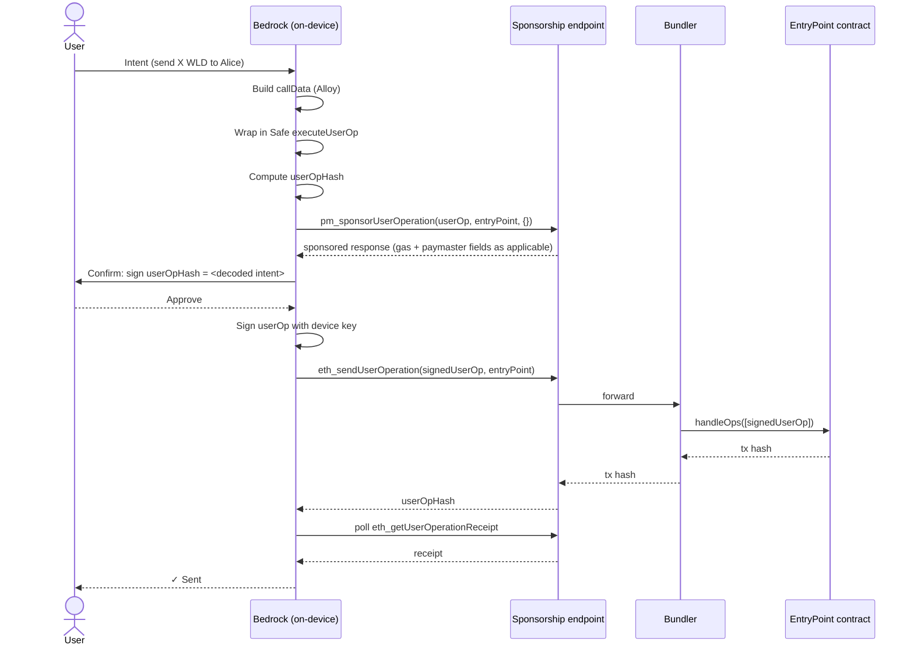
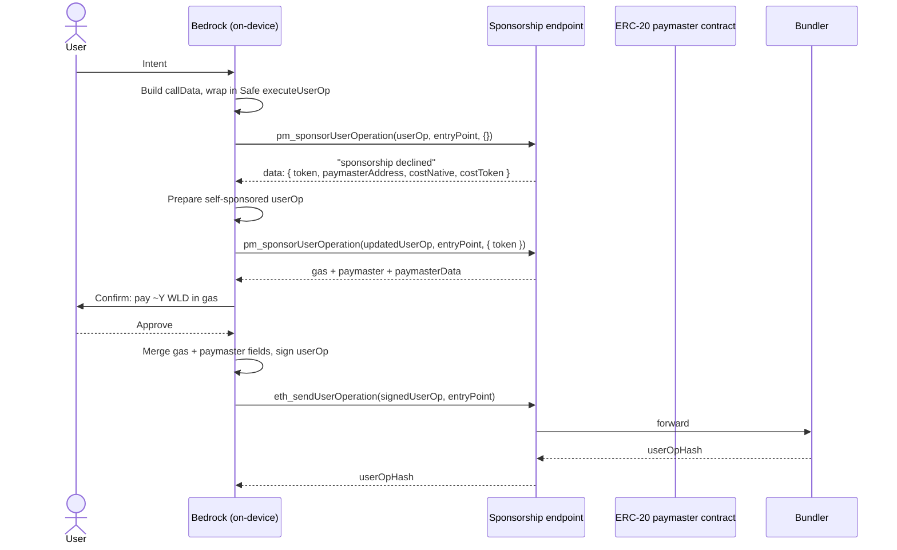

# Prepare & Sign Transaction (V2 flow)

This document describes the **V2** on-device flow: how Bedrock — the
open-source, on-device SDK that powers the wallet — turns a user intent
(e.g. "send 5 WLD to `0x…`") into a signed
[ERC-4337 UserOperation](https://eips.ethereum.org/EIPS/eip-4337) that lands on
chain. The earlier prepare/send flow is being phased out per transaction type;
see [Versioning and compatibility](#versioning-and-compatibility) below.

It is a living document. The wallet's sponsorship policy evolves over time;
when it changes, this file changes with it. The on-device steps Bedrock performs
do not depend on the server's policy — only on the wire contract described
below.

## Trust model

The wallet is **self-custodial**. The user's signing key never leaves the
device, and the user should sign only payloads they can independently verify.
Bedrock is structured around that invariant:

- **Bedrock constructs the calldata locally.** All encoding — ERC-20
  calls, Safe `executeUserOp` wrapping, and any composition needed for a
  given transaction — happens on device, using
  [Alloy](https://github.com/alloy-rs/core) primitives that the user (or a
  third-party auditor) can inspect by reading the Bedrock source.
- **The user signs the UserOp hash** The hash is
  derived from the fully-assembled UserOp (sender, nonce, callData, gas
  fields, paymaster fields if any) per
  [ERC-4337 §4.1](https://eips.ethereum.org/EIPS/eip-4337#useroperation).

## High-level flow

For every transaction:

1. **Build callData.** Encode the contract call (ERC-20 `transfer`, ERC-4626
   `deposit`, etc.) using Alloy.
2. **Wrap in `executeUserOp`.** The user's wallet is a
   [Safe smart account](https://docs.safe.global/) with the ERC-4337 module
   installed. Bedrock wraps the inner call in a
   `executeUserOp(to, value, data, operation)` invocation on the module so
   the UserOp executes through the smart account when the EntryPoint
   dispatches it.
3. **Compute the UserOp hash locally.** Used for confirmation UI.
4. **Ask for sponsorship.** Bedrock calls `pm_sponsorUserOperation` with an
   empty context. The endpoint either sponsors directly (the protocol pays gas
   on the user's behalf) or returns a structured decline with the information
   needed to retry as a self-sponsored transaction.
5. **(Decline branch only.) Retry as self-sponsored.** Bedrock retries the
   request in self-sponsored mode using the token returned in the decline
   payload; the endpoint then returns the gas estimates and paymaster
   fields needed to finalise the UserOp.
6. **Sign.** Bedrock merges the gas (and paymaster, if any) fields into the
   UserOp and signs locally with the device key.
7. **Submit.** `eth_sendUserOperation` forwards the UserOp to a bundler which calls `handleOps` on the
   [EntryPoint](https://eips.ethereum.org/EIPS/eip-4337#entrypoint).
8. **Poll for receipt.** Bedrock polls `eth_getUserOperationReceipt` until
   the UserOp is mined.

## Sponsored path (protocol pays gas)



The sponsored response carries the gas fields and paymaster fields (when
applicable) needed for Bedrock to finalise and sign the UserOp. Bedrock
merges the populated fields into the UserOp and signs; fields the response
omits are left unset on the UserOp.

## Decline → self-sponsored retry (user pays gas in an ERC-20 token)

When the protocol declines to sponsor, the wallet falls back to the user
paying gas in an ERC-20 token (e.g. WLD) routed through an ERC-20 paymaster
contract.



**Wire shape — decline payload (`-32602`):**

| Field              | Required | Meaning                                                                                      |
| ------------------ | -------- | -------------------------------------------------------------------------------------------- |
| `token`            | yes      | ERC-20 token address the user should pay gas in (e.g. WLD). Bedrock uses this for the retry. |
| `paymasterAddress` | yes      | ERC-20 paymaster contract that will pull the fee at execution time.                          |
| `costNative`       | yes      | Estimated gas cost in native currency.                                                       |
| `costToken`        | yes      | Estimated gas cost in ERC-20 token currency.                                                 |

**Wire shape — self-sponsored response:**

```json
{
  "callGasLimit": "0x…",
  "verificationGasLimit": "0x…",
  "preVerificationGas": "0x…",
  "maxFeePerGas": "0x…",
  "maxPriorityFeePerGas": "0x…",
  "paymaster": "0x…",
  "paymasterData": "0x…",
  "paymasterVerificationGasLimit": "0x…",
  "paymasterPostOpGasLimit": "0x…"
}
```

All gas fields populated, all paymaster fields present. Bedrock merges them
into the UserOp and calls `with_paymaster_data()` before signing.

## Per-step details

### 1. Build callData

Done locally with Alloy. The relevant function is encoded against the contract ABI.

### 2. Wrap in `executeUserOp`

The actual call is wrapped in `executeUserOp(to, value, data, operation)` on
the Safe's ERC-4337 module. This becomes the `callData` field of the UserOp;
when the EntryPoint dispatches the UserOp, it calls `executeUserOp` on the
smart account, which performs the inner call.

### 3. Compute the UserOp hash

ERC-4337's UserOp hash is deterministic given the fully-assembled UserOp,
the EntryPoint address, and the chain ID. Bedrock computes it locally.

### 4. First sponsorship call

`pm_sponsorUserOperation` is called with the partial UserOp (sender, nonce,
callData, signature placeholder) and an empty context. The endpoint inspects current conditions and either:

- returns a 200 response carrying the fields needed to sign and submit, or
- returns `-32602 "sponsorship declined"` with the structured payload above.

### 5. Self-sponsored retry

When the protocol declines to sponsor, Bedrock retries the request in
self-sponsored mode using the token returned in the decline payload. The
second response carries the gas estimates and paymaster fields needed to
finalise the UserOp.

### 6. Sign

The UserOp is finalised by merging the gas and
paymaster fields. Bedrock recomputes the UserOp hash to ensure it still
corresponds to the intent shown to the user, then signs with the device key.

### 7. Submit

`eth_sendUserOperation(signedUserOp, entryPoint)`. The endpoint forwards to
a bundler. Bedrock receives the userOpHash back and stores it for receipt
polling.

### 8. Poll for receipt

`eth_getUserOperationReceipt` is polled until the UserOp is mined or until a
deadline is reached. The user-facing state machine (`pending`, `mined`,
`failed`) is derived from the receipt.

## References

- [ERC-4337 — Account Abstraction Using EntryPoint](https://eips.ethereum.org/EIPS/eip-4337)
- [EIP-7677 — Paymaster Web Service Capability](https://eips.ethereum.org/EIPS/eip-7677)
- [EIP-7769 — JSON-RPC error codes for ERC-4337](https://eips.ethereum.org/EIPS/eip-7769)
- [JSON-RPC 2.0 Specification](https://www.jsonrpc.org/specification)
- [Safe Smart Account documentation](https://docs.safe.global/)
- Bedrock source: `bedrock/src/transactions/` (`rpc.rs`, `mod.rs`,
  `contracts/`)
