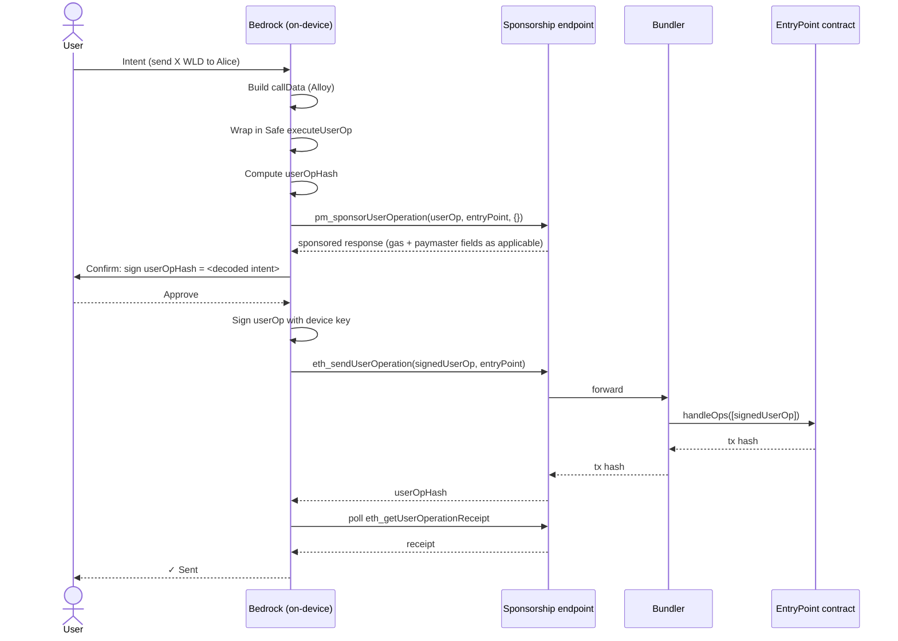
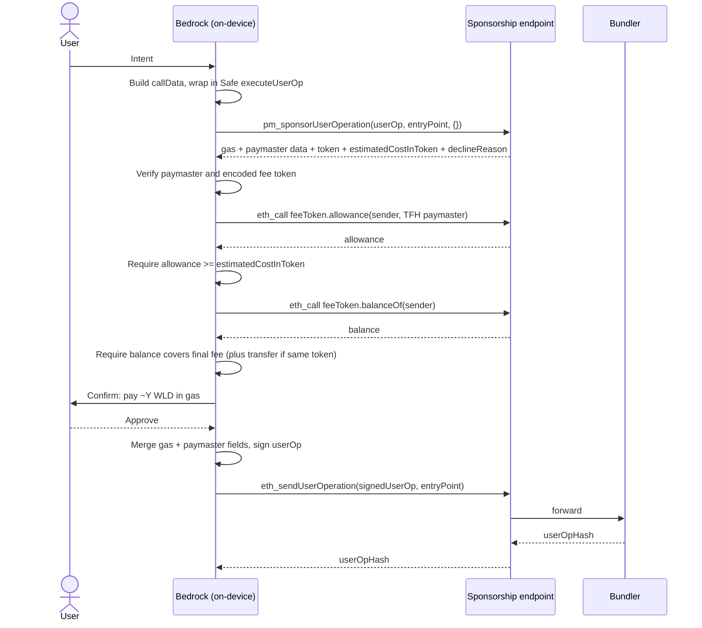

# Prepare & Sign Transaction (V2 flow)

This document describes the **V2** on-device flow: how Bedrock — the
open-source, on-device SDK that powers the wallet — turns a user intent
(e.g. "send 5 WLD to `0x…`") into a signed
[ERC-4337 UserOperation](https://eips.ethereum.org/EIPS/eip-4337) that lands on
chain.

It is a living document. The wallet's sponsorship policy evolves over time;
when it changes, this file changes with it. The on-device steps Bedrock performs
do not depend on the server's policy — only on the wire contract described
below.

## Trust model

The wallet is **self-custodial**. The user's signing key never leaves the
device, and the user should sign only payloads they can independently verify.
Bedrock is structured around that invariant:

- **Bedrock constructs the calldata locally.** All encoding — ERC-20
  calls, Safe `executeUserOp` wrapping, and any composition needed for a
  given transaction — happens on device, using
  [Alloy](https://github.com/alloy-rs/core) primitives that the user (or a
  third-party auditor) can inspect by reading the Bedrock source.
- **The user signs the UserOp hash** The hash is
  derived from the fully-assembled UserOp (sender, nonce, callData, gas
  fields, paymaster fields if any) per
  [ERC-4337 §4.1](https://eips.ethereum.org/EIPS/eip-4337#useroperation).

## High-level flow

For every transaction:

1. **Build callData.** Encode the contract call (ERC-20 `transfer`, ERC-4626
   `deposit`, etc.) using Alloy.
2. **Wrap in `executeUserOp`.** The user's wallet is a
   [Safe smart account](https://docs.safe.global/) with the ERC-4337 module
   installed. Bedrock wraps the inner call in a
   `executeUserOp(to, value, data, operation)` invocation on the module so
   the UserOp executes through the smart account when the EntryPoint
   dispatches it.
3. **Compute the UserOp hash locally.** Used for confirmation UI.
4. **Prepare sponsorship.** Bedrock calls `pm_sponsorUserOperation` once with
   empty context. A successful response describes either a protocol-paid operation
   or a TFH token-paid operation with its final fee estimate and policy reason.
5. **Validate and review.** For a token-paid response, verify the paymaster and
   encoded fee token, then check allowance and balance against the final estimate.
   Wallet migration owns approvals. Present the transfer and fee before signing.
6. **Sign.** Bedrock merges the gas (and paymaster, if any) fields into the
   UserOp and signs locally with the device key.
7. **Submit.** `eth_sendUserOperation` forwards the UserOp to a bundler which calls `handleOps` on the
   [EntryPoint](https://eips.ethereum.org/EIPS/eip-4337#entrypoint).
8. **Poll for receipt.** Bedrock polls `eth_getUserOperationReceipt` until
   the UserOp is mined.

## Sponsored path (protocol pays gas)


```mermaid
sequenceDiagram
    actor User
    participant Bedrock as Bedrock (on-device)
    participant Endpoint as Sponsorship endpoint
    participant Bundler
    participant EP as EntryPoint contract

    User->>Bedrock: Intent (send X WLD to Alice)
    Bedrock->>Bedrock: Build callData (Alloy)
    Bedrock->>Bedrock: Wrap in Safe executeUserOp
    Bedrock->>Bedrock: Compute userOpHash

    Bedrock->>Endpoint: pm_sponsorUserOperation(userOp, entryPoint, {})
    Endpoint-->>Bedrock: sponsored response (gas + paymaster fields as applicable)

    Bedrock->>User: Confirm: sign userOpHash = <decoded intent>
    User-->>Bedrock: Approve
    Bedrock->>Bedrock: Sign userOp with device key

    Bedrock->>Endpoint: eth_sendUserOperation(signedUserOp, entryPoint)
    Endpoint->>Bundler: forward
    Bundler->>EP: handleOps([signedUserOp])
    EP-->>Bundler: tx hash
    Bundler-->>Endpoint: tx hash
    Endpoint-->>Bedrock: userOpHash

    Bedrock->>Endpoint: poll eth_getUserOperationReceipt
    Endpoint-->>Bedrock: receipt
    Bedrock-->>User: ✓ Sent
```

The sponsored response carries the gas fields and paymaster fields (when
applicable) needed for Bedrock to finalise and sign the UserOp. Bedrock
merges the populated fields into the UserOp and signs; fields the response
omits are left unset on the UserOp.

## Token-paid path (user pays gas in an ERC-20 token)

When the protocol declines to sponsor, the wallet falls back to the user
paying gas in an ERC-20 token (e.g. WLD) through the TFH paymaster. The wallet
migration must have established sufficient fee-token allowance beforehand.


```mermaid
sequenceDiagram
    actor User
    participant Bedrock as Bedrock (on-device)
    participant Endpoint as Sponsorship endpoint
    participant Bundler

    User->>Bedrock: Intent
    Bedrock->>Bedrock: Build callData, wrap in Safe executeUserOp

    Bedrock->>Endpoint: pm_sponsorUserOperation(userOp, entryPoint, {})
    Endpoint-->>Bedrock: gas + paymaster data + token + estimatedCostInToken + declineReason
    Bedrock->>Bedrock: Verify paymaster and encoded fee token
    Bedrock->>Endpoint: eth_call feeToken.allowance(sender, TFH paymaster)
    Endpoint-->>Bedrock: allowance
    Bedrock->>Bedrock: Require allowance >= estimatedCostInToken
    Bedrock->>Endpoint: eth_call feeToken.balanceOf(sender)
    Endpoint-->>Bedrock: balance
    Bedrock->>Bedrock: Require balance covers final fee (plus transfer if same token)

    Bedrock->>User: Confirm: pay ~Y WLD in gas
    User-->>Bedrock: Approve
    Bedrock->>Bedrock: Merge gas + paymaster fields, sign userOp

    Bedrock->>Endpoint: eth_sendUserOperation(signedUserOp, entryPoint)
    Endpoint->>Bundler: forward
    Bundler-->>Endpoint: userOpHash
    Endpoint-->>Bedrock: userOpHash
```

**Wire shape — self-sponsored response:**

```json
{
  "callGasLimit": "0x…",
  "verificationGasLimit": "0x…",
  "preVerificationGas": "0x…",
  "maxFeePerGas": "0x…",
  "maxPriorityFeePerGas": "0x…",
  "paymaster": "0x…",
  "paymasterData": "0x…",
  "paymasterVerificationGasLimit": "0x…",
  "paymasterPostOpGasLimit": "0x…",
  "estimatedCostInToken": "123456789",
  "token": "0x…",
  "declineReason": "gas_usage"
}
```

All gas and paymaster fields are present on token-paid results. The positive
`estimatedCostInToken` is a decimal integer in token base units, priced from the
final gas fields. It is used for confirmation and balance/allowance checks.
The encoded charge ceiling is a separate contract limit, not the displayed estimate.
Protocol-sponsored results omit all paymaster and fee fields.

Bedrock preserves unknown `declineReason` strings for newer sponsorship policies.
Incomplete paid results and malformed fee data stop preparation.

## Per-step details

### 1. Build callData

Done locally with Alloy. The relevant function is encoded against the contract ABI.

### 2. Wrap in `executeUserOp`

The actual call is wrapped in `executeUserOp(to, value, data, operation)` on
the Safe's ERC-4337 module. This becomes the `callData` field of the UserOp;
when the EntryPoint dispatches the UserOp, it calls `executeUserOp` on the
smart account, which performs the inner call.

### 3. Compute the UserOp hash

ERC-4337's UserOp hash is deterministic given the fully-assembled UserOp,
the EntryPoint address, and the chain ID. Bedrock computes it locally.

### 4. Prepare sponsorship

`pm_sponsorUserOperation` takes the partial UserOp (sender, nonce, calldata,
signature placeholder) and empty context. The endpoint returns either zeroed gas
fields for protocol sponsorship or final gas, paymaster, and fee fields for a
TFH token-paid operation. A policy decline is metadata on a successful paid
result; preparation failures remain RPC errors.

### 5. Validate the fee and review

A token-paid result must name `TFH_PAYMASTER_ADDRESS`, include all paymaster
fields, and supply the token, positive fee estimate, and policy reason. Bedrock
decodes the paymaster data and verifies that its token matches the fee quote.
The estimate is retained in `PreparedTransactionFee` for confirmation; it does
not replace the independent charge ceiling encoded in `paymasterData`.

After token-paid preparation, Bedrock reads the fee-token allowance and balance.
The allowance must cover the final fee. When the transfer spends the same token,
the balance must cover the transfer amount plus that fee; otherwise it must cover
the fee alone. A shortfall returns `TransactionError::InsufficientFunds`, including
the fee-token address, with "Not enough funds to cover the transfer and network
fee." Mobile can map this error to localized confirmation text. Failed reads or
insufficient allowance also stop preparation.

`TfhPaymasterApprovalMigration` maintains approvals through client-built,
client-signed operations with sponsored gas. Preparation does not change
allowances, sign operations, or submit transactions. These checks do not reserve
funds or guarantee execution: balances and contract state can change afterward.

### 6. Sign

The UserOp is finalised by merging the gas and
paymaster fields. Bedrock recomputes the UserOp hash to ensure it still
corresponds to the intent shown to the user, then signs with the device key.

### 7. Submit

`eth_sendUserOperation(signedUserOp, entryPoint)`. The endpoint forwards to
a bundler. Bedrock receives the userOpHash back and stores it for receipt
polling.

### 8. Poll for receipt

`eth_getUserOperationReceipt` is polled until the UserOp is mined or until a
deadline is reached. The user-facing state machine (`pending`, `mined`,
`failed`) is derived from the receipt.

## References

- [ERC-4337 — Account Abstraction Using EntryPoint](https://eips.ethereum.org/EIPS/eip-4337)
- [EIP-7677 — Paymaster Web Service Capability](https://eips.ethereum.org/EIPS/eip-7677)
- [EIP-7769 — JSON-RPC error codes for ERC-4337](https://eips.ethereum.org/EIPS/eip-7769)
- [JSON-RPC 2.0 Specification](https://www.jsonrpc.org/specification)
- [Safe Smart Account documentation](https://docs.safe.global/)
- Bedrock source: `bedrock/src/transactions/` (`rpc.rs`, `mod.rs`,
  `contracts/`)
