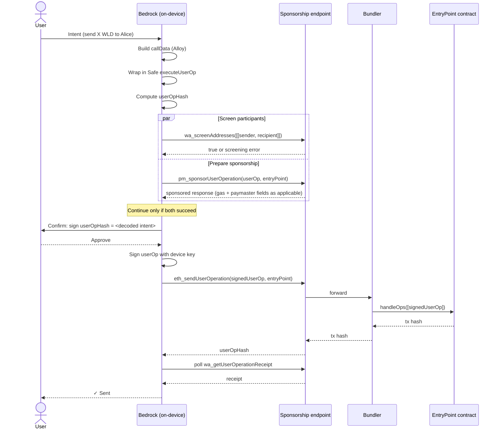
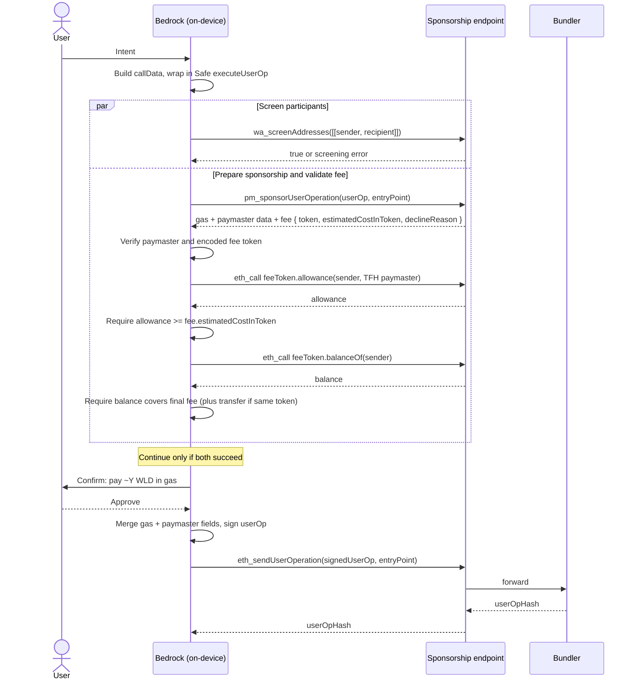

# Prepare and submit transactions

This document describes the on-device transaction lifecycle: how Bedrock — the
open-source, on-device SDK that powers the wallet — turns a user intent
(e.g. transfer tokens or deposit into a vault) into a signed
[ERC-4337 UserOperation](https://eips.ethereum.org/EIPS/eip-4337) that lands on
chain.

The lifecycle is shared across transaction types. The prepared-transaction APIs
`prepare_transaction_transfer`, `prepare_transaction_erc4626_deposit`, and
`submit_prepared_transaction` implement it for transfers and vault deposits on
World Chain. The diagrams use transfers as a concrete example.

It is a living document. The wallet's sponsorship policy evolves over time;
when it changes, this file changes with it. The on-device steps Bedrock performs
do not depend on the server's policy — only on the wire contract described
below.

## Trust model

The wallet is **self-custodial**. The user's signing key never leaves the
device, and the user should sign only payloads they can independently verify.
Bedrock is structured around that invariant:

- **Bedrock constructs the calldata locally.** All encoding — ERC-20
  calls, Safe `executeUserOp` wrapping, and any composition needed for a
  given transaction — happens on device, using
  [Alloy](https://github.com/alloy-rs/core) primitives that the user (or a
  third-party auditor) can inspect by reading the Bedrock source.
- **The user signs the UserOp hash** The hash is
  derived from the fully-assembled UserOp (sender, nonce, callData, gas
  fields, paymaster fields if any) per
  [ERC-4337 §4.1](https://eips.ethereum.org/EIPS/eip-4337#useroperation).

## High-level flow

The shared lifecycle is:

1. **Build callData.** Encode the contract call (ERC-20 `transfer`, ERC-4626
   `deposit`, etc.) using Alloy.
2. **Wrap in `executeUserOp`.** The user's wallet is a
   [Safe smart account](https://docs.safe.global/) with the ERC-4337 module
   installed. Bedrock wraps the inner call in a
   `executeUserOp(to, value, data, operation)` invocation on the module so
   the UserOp executes through the smart account when the EntryPoint
   dispatches it.
3. **Compute the UserOp hash locally.** Used for confirmation UI.
4. **Screen addresses and request sponsorship.** Bedrock screens the Safe sender
   and token recipient with `wa_screenAddresses`, in parallel with preparation.
   Both must succeed before returning a prepared transaction. Bedrock calls `pm_sponsorUserOperation` with the UserOp
   and EntryPoint. If approved, TFH pays for the operation. If declined, the response
   includes gas, paymaster, and fee information for self-sponsorship through the
   TFH paymaster.
5. **Validate and review.** For a self-sponsored response, verify the paymaster and
   encoded fee token, then check allowance and balance against the final estimate.
   Wallet migration owns approvals. Present the transaction and fee before signing.
6. **Sign.** Bedrock merges the gas (and paymaster, if any) fields into the
   UserOp and signs locally with the device key.
7. **Submit.** `eth_sendUserOperation` forwards the UserOp to a bundler which calls `handleOps` on the
   [EntryPoint](https://eips.ethereum.org/EIPS/eip-4337#entrypoint).
8. **Poll for receipt.** The app can use Bedrock's `wa_getUserOperationReceipt`
   call to track the UserOp until it is mined.

## Sponsored path (protocol pays gas)


```mermaid
sequenceDiagram
    actor User
    participant Bedrock as Bedrock (on-device)
    participant Endpoint as Sponsorship endpoint
    participant Bundler
    participant EP as EntryPoint contract

    User->>Bedrock: Intent (send X WLD to Alice)
    Bedrock->>Bedrock: Build callData (Alloy)
    Bedrock->>Bedrock: Wrap in Safe executeUserOp
    Bedrock->>Bedrock: Compute userOpHash

    par Screen participants
        Bedrock->>Endpoint: wa_screenAddresses([[sender, recipient]])
        Endpoint-->>Bedrock: true or screening error
    and Prepare sponsorship
        Bedrock->>Endpoint: pm_sponsorUserOperation(userOp, entryPoint)
        Endpoint-->>Bedrock: sponsored response (gas + paymaster fields as applicable)
    end
    Note over Bedrock: Continue only if both succeed

    Bedrock->>User: Confirm: sign userOpHash = <decoded intent>
    User-->>Bedrock: Approve
    Bedrock->>Bedrock: Sign userOp with device key

    Bedrock->>Endpoint: eth_sendUserOperation(signedUserOp, entryPoint)
    Endpoint->>Bundler: forward
    Bundler->>EP: handleOps([signedUserOp])
    EP-->>Bundler: tx hash
    Bundler-->>Endpoint: tx hash
    Endpoint-->>Bedrock: userOpHash

    Bedrock->>Endpoint: poll wa_getUserOperationReceipt
    Endpoint-->>Bedrock: receipt
    Bedrock-->>User: ✓ Sent
```

The sponsored response carries the gas fields and paymaster fields (when
applicable) needed for Bedrock to finalise and sign the UserOp. Bedrock
merges the populated fields into the UserOp and signs; fields the response
omits are left unset on the UserOp.

## Self-sponsored path (user pays gas in an ERC-20 token)

When TFH declines sponsorship, the user pays gas in an ERC-20 token (e.g. WLD)
through the TFH paymaster. Self-sponsorship requires sufficient fee-token
allowance, maintained by wallet migration.


```mermaid
sequenceDiagram
    actor User
    participant Bedrock as Bedrock (on-device)
    participant Endpoint as Sponsorship endpoint
    participant Bundler

    User->>Bedrock: Intent
    Bedrock->>Bedrock: Build callData, wrap in Safe executeUserOp

    par Screen participants
        Bedrock->>Endpoint: wa_screenAddresses([[sender, recipient]])
        Endpoint-->>Bedrock: true or screening error
    and Prepare sponsorship and validate fee
        Bedrock->>Endpoint: pm_sponsorUserOperation(userOp, entryPoint)
        Endpoint-->>Bedrock: gas + paymaster data + fee { token, estimatedCostInToken, declineReason }
        Bedrock->>Bedrock: Verify paymaster and encoded fee token
        Bedrock->>Endpoint: eth_call feeToken.allowance(sender, TFH paymaster)
        Endpoint-->>Bedrock: allowance
        Bedrock->>Bedrock: Require allowance >= fee.estimatedCostInToken
        Bedrock->>Endpoint: eth_call feeToken.balanceOf(sender)
        Endpoint-->>Bedrock: balance
        Bedrock->>Bedrock: Require balance covers final fee (plus transfer if same token)
    end
    Note over Bedrock: Continue only if both succeed

    Bedrock->>User: Confirm: pay ~Y WLD in gas
    User-->>Bedrock: Approve
    Bedrock->>Bedrock: Merge gas + paymaster fields, sign userOp

    Bedrock->>Endpoint: eth_sendUserOperation(signedUserOp, entryPoint)
    Endpoint->>Bundler: forward
    Bundler-->>Endpoint: userOpHash
    Endpoint-->>Bedrock: userOpHash
```

**Wire shape — self-sponsored response:**

```json
{
  "callGasLimit": "0x…",
  "verificationGasLimit": "0x…",
  "preVerificationGas": "0x…",
  "maxFeePerGas": "0x…",
  "maxPriorityFeePerGas": "0x…",
  "paymaster": "0x…",
  "paymasterData": "0x…",
  "paymasterVerificationGasLimit": "0x…",
  "paymasterPostOpGasLimit": "0x…",
  "fee": {
    "estimatedCostInToken": "123456789",
    "token": "0x…",
    "declineReason": "gas_usage"
  }
}
```

All gas and paymaster fields are present on self-sponsored results. The positive
`fee.estimatedCostInToken` is a decimal integer in token base units, priced from the
final gas fields. It is used for confirmation and balance/allowance checks.
The charge ceiling encoded in `paymasterData` limits the authorized token charge.
TFH-sponsored results omit all paymaster fields and the `fee` object.

Bedrock preserves unknown `fee.declineReason` strings for unrecognized sponsorship policies.
Incomplete self-sponsored results and malformed fee data stop preparation.

## Per-step details

### 1. Build callData

Done locally with Alloy. The relevant function is encoded against the contract ABI.

### 2. Wrap in `executeUserOp`

The actual call is wrapped in `executeUserOp(to, value, data, operation)` on
the Safe's ERC-4337 module. This becomes the `callData` field of the UserOp;
when the EntryPoint dispatches the UserOp, it calls `executeUserOp` on the
smart account, which performs the inner call.

### 3. Compute the UserOp hash

ERC-4337's UserOp hash is deterministic given the fully-assembled UserOp,
the EntryPoint address, and the chain ID. Bedrock computes it locally.

### 4. Screen addresses and prepare sponsorship

For ERC-20 transfers without a custom bundler URL, `prepare_transaction_transfer`
uses the authenticated backend endpoint `/v3/rpc/worldchain`. Contract reads use
`/v2/rpc/worldchain`.

`pm_sponsorUserOperation` takes the partial UserOp (sender, nonce, calldata,
signature placeholder) and EntryPoint address. Sponsored responses include nonzero
`callGasLimit` and `verificationGasLimit`, zero `preVerificationGas` and fee prices,
and no paymaster. Self-sponsored responses include gas, paymaster, and fee fields
for payment through the TFH paymaster. Self-sponsored responses include the
reason TFH declined sponsorship. Simulation or fee-quotation failures return RPC
errors. This method handles sponsorship without screening addresses.

For both default and custom-bundler routes, Bedrock calls authenticated
`wa_screenAddresses` on `/v3/rpc/worldchain` with `[[sender, recipient]]`.
The recipient is the ERC-20 transfer destination, not the token contract.
The endpoint accepts 1 to 32 addresses and returns JSON `true` only when every
supplied address clears. Bedrock runs this call in parallel with backend
sponsorship or custom-bundler estimation. Both must succeed before returning a
prepared transaction for signing. A restricted address, unavailable screening,
malformed response, or network failure stops preparation without switching routes.
All preparation routes require an initialized HTTP client.

A restricted address returns RPC error `-32602` with reason `address_restricted`
and `retryable: false`. Unavailable screening returns `-32603` with reason
`screening_unavailable` and `retryable: true`; clients may retry preparation.
Bedrock exposes these as `TransactionError::AddressRestricted` and
`TransactionError::ScreeningUnavailable` in Swift/Kotlin. Other RPC, transport,
and malformed-response failures produce generic preparation errors.
Deploy the endpoint through the authenticated V3 gateway before enabling either
preparation route. Bedrock owns participant selection and the pre-sign gate;
clearance is not a server-side authorization bound to a UserOperation.

When `prepare_transaction_transfer` receives a custom bundler URL, Bedrock calls
`eth_estimateUserOperationGas` directly at that URL with the unsigned operation
and EntryPoint, alongside the shared screening request.

This route requires a bundler that covers gas costs. Bedrock uses
the returned `callGasLimit` and `verificationGasLimit`, keeps `preVerificationGas`
and both fee prices at zero, and leaves paymaster fields absent. It does not call
either backend sponsorship method or offer ERC-20 self-sponsorship on this route.
The prepared transaction retains the URL for submission. Address screening applies
before signing; submission does not screen the signed operation. Estimation errors stop
preparation; a successful estimate does not guarantee acceptance at submission.

### 5. Validate the fee and review

A self-sponsored result must name `TFH_PAYMASTER_ADDRESS`, include all paymaster
fields, and supply a `fee` object with the token, positive fee estimate, and policy reason. Bedrock
decodes the paymaster data and verifies that its token matches the fee quote.
The estimate is stored in `PreparedTransactionFee` for confirmation.

ERC-20 transfer preparation reads the fee-token allowance and balance for
self-sponsored operations. The allowance must cover the final fee. When the
transfer spends the same token,
the balance must cover the transfer amount plus that fee; otherwise it must cover
the fee alone. A shortfall returns `TransactionError::InsufficientFunds`, including
the fee-token address, with "Not enough funds to cover the transfer and network
fee." Mobile can map this error to localized confirmation text. Failed reads or
insufficient allowance also stop preparation.

`TfhPaymasterApprovalMigration` maintains approvals through client-built,
client-signed operations with TFH-sponsored gas. Allowance and balance checks
reflect the state at preparation time; balances and contract state can change
before execution.

### 6. Sign

The UserOp is finalised by merging the gas and
paymaster fields. Bedrock recomputes the UserOp hash to ensure it still
corresponds to the intent shown to the user, then signs with the device key.

### 7. Submit

For default prepared ERC-20 transfers, `submit_prepared_transaction` sends
`[signedUserOp, entryPoint]` with `eth_sendUserOperation` to `/v3/rpc/worldchain`.
The backend selects the bundler and rechecks sponsorship policy for sponsored
operations. Bedrock sends the signed fields unchanged and
returns the userOpHash for receipt tracking. Submission errors are returned to
the caller; Bedrock does not automatically re-prepare or resubmit the operation.

For a prepared custom-bundler transaction, Bedrock signs after confirmation and
submits directly to the retained URL. Submission errors are returned to the
caller without switching to the backend or another bundler.

### 8. Poll for receipt

`wa_getUserOperationReceipt` uses `/v1/rpc/worldchain`. The caller polls until
the UserOp reaches a terminal state or its tracking deadline is reached.

## References

- [ERC-4337 — Account Abstraction Using EntryPoint](https://eips.ethereum.org/EIPS/eip-4337)
- [EIP-7677 — Paymaster Web Service Capability](https://eips.ethereum.org/EIPS/eip-7677)
- [EIP-7769 — JSON-RPC error codes for ERC-4337](https://eips.ethereum.org/EIPS/eip-7769)
- [JSON-RPC 2.0 Specification](https://www.jsonrpc.org/specification)
- [Safe Smart Account documentation](https://docs.safe.global/)
- Bedrock source: `bedrock/src/transactions/` (`rpc.rs`, `mod.rs`,
  `contracts/`)

## ERC-4626 deposit preparation

`prepare_transaction_erc4626_deposit(vault_address, asset_amount, custom_bundler_url)`
builds the asset approval and vault deposit locally. It screens the wallet with
`wa_screenAddresses` in parallel with construction and sponsorship or custom
bundler estimation. The wallet owns the assets and receives the shares. Vault
selection and program eligibility are the caller's responsibility.

The result is a `PreparedVaultTransaction`: `asset_address` identifies the underlying
token, `asset_amount` is the amount encoded after capping it to the available
balance, and `transaction` holds the unsigned operation. Display that amount and
`transaction.fee_details()` before confirmation, then pass `transaction` to
`submit_prepared_transaction`.

For a deposit spending the fee token, the balance must cover the deposit plus the
quoted fee. Preparation does not reduce the deposit to fund gas; insufficient
funds require the caller to choose another amount and prepare again. For other
deposit assets, the fee-token balance must cover the fee alone. Custom bundlers
cover gas and receive estimation and submission at the same supplied URL.

The all-in-one `transaction_erc4626_deposit` API uses V1 execution.
